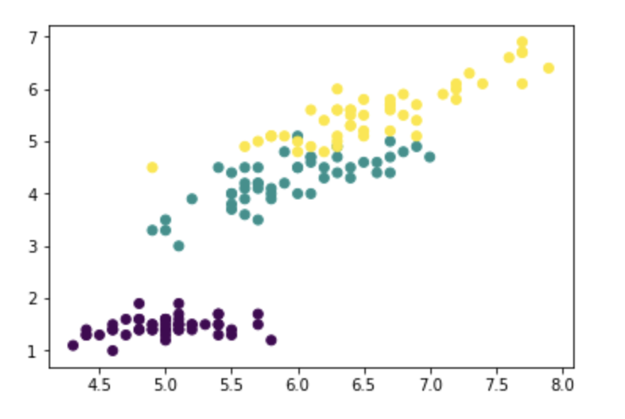
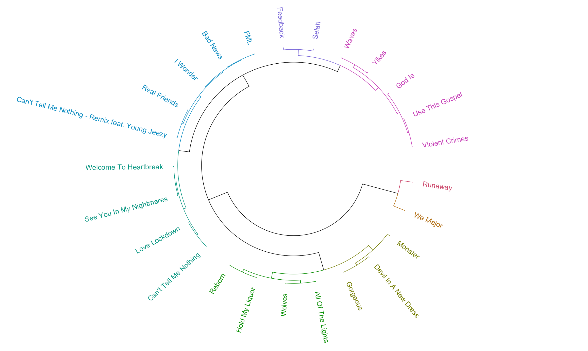

```{r Setup, echo = FALSE}
library(knitr)
knitr::opts_chunk$set(
  eval = TRUE,
  echo = FALSE
)

```


layout: false
background-image: url(https://mk0floridapolyrvphbf.kinstacdn.com/wp-content/themes/floridapolytechnic/images/logo.svg)
background-position: 95% 0%
background-size: 10%

```{r setup, include=FALSE}
options(htmltools.dir.version = FALSE, servr.interval = 0.5)
library(knitr)
opts_chunk$set(
  fig.align="center", fig.width=6, fig.height=4.5, 
  out.width="748px", #out.length="520.75px",
  dpi=300, #fig.path='Figs/',
  cache=F#, echo=F, warning=F, message=F
  )
knitr::opts_chunk$set(comment = NA, message = NA)

```


# Table of contents


[Summary of Project](#ep1)

[The Spotify Dataset](#ep2)

[What is Hierarcichal Clustering?](#ep3)


---
class: inverse, center, middle
name: ep1

# Summary

<html><div style='float:left'></div><hr color='#EB811B' size=1px width=796px></html>


---
# Summary

This project is going to be developed using the Spotify API. More specifically, the R wrapper for the spotify API. The main curiousity is the analysis of the dataset to find out the answers to some questions. Namely,

- What relationships are there between different genres/styles of music?  
- What kinds of emotions are displayed in music and how does that change over time?  
- Which regions in the world listen to which genres and emotional qualities of music, and can that be related with seasonality at all?  
- How has music composition change over time? 
---

class: inverse, center, middle
name: ep2

# The Spotify Dataset

<html><div style='float:left'></div><hr color='#EB811B' size=1px width=796px></html>

---
#The Spotify Dataset (cont.)
The Spotify dataset is access via an R wrapper for the spotify API. This R wrapper is called [spotifyr](https://cran.r-project.org/web/packages/spotifyr/spotifyr.pdf) and it includes the ability to pull from a user's account a variety of information about songs, albums, artists, and playlists. This is necessary because Spotify uses very specific measures to categorize songs. These categorization include but are not limited to:

- **Instrumentalness** The amount of instrumentation is in a song (versus lyrics, electronics, etc.)
- **Valence** A measure of how positive or negative a song is
- **Key** The key center of a song 
- **Tempo** The tempo of a song
- **Other emotional measures** a more complex set of variables showing different moods (other than positive/negative).

---
class: inverse, center, middle
name: ep3

# What is Hierarchical Clustering

<html><div style='float:left'></div><hr color='#EB811B' size=1px width=796px></html>

---

#Hierarchical Clustering

Clustering is a form of machine learning in which inferences can be made about data by combining and assigning them to clustering. This is **Unsupervised Learning**, a technique for use cases in which the dataset is not labelled and classification cannot be done. 
```{r , echo=FALSE, fig.cap="Clustering of the 'IRIS' Dataset", out.width = '70%'}

```

---
#Hierarchical Clustering (cont.)

Hierarchical Clustering is similar in that the data is assembled into areas of similarity ("clusters") but instead of them generally being clustered a "hierarchy" is established. This starts with two clusters where the two closest members are the furthest from each other, combining them until one large cluster remains. 

Here is the formula that repeats until one cluster remains:
$$d(G_i,G_j) =  \max_{X^r \epsilon G_i, X^s \epsilon G_j} d(X^T,X^x)$$
Where:
- $d( x, y)$ is the distance according to some metric
- $G_i$ is a cluster
- $X_i$ is an instance i

---
#Hierarchical Clustering (cont.)
The objective is to produce clusters like the ones below and establish a better comparative basis for different genres of music. This is the top 25 most "negative" songs by the artist Kanye West clustered.
```{r pressure, echo=FALSE, fig.cap="The Most Negative Kanye Tracks, Clustered", out.width = '80%'}

```

